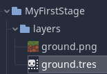
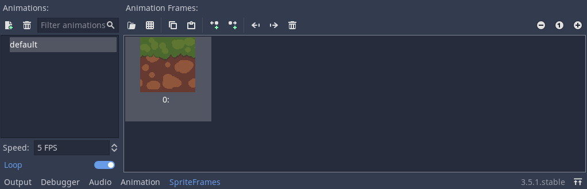
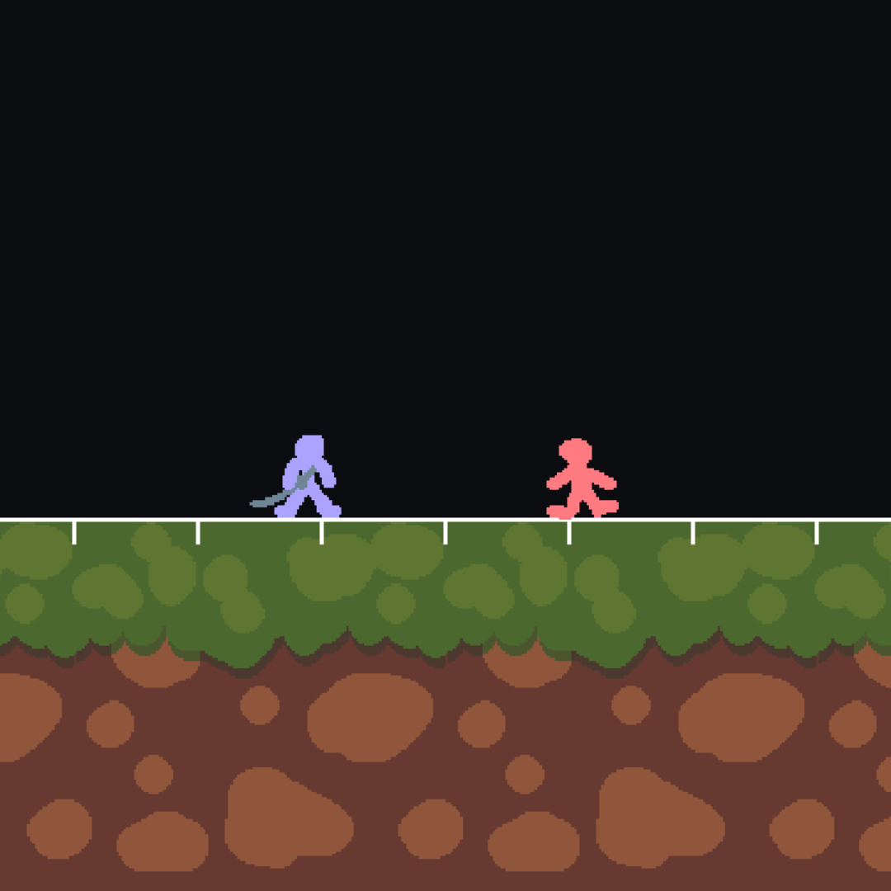
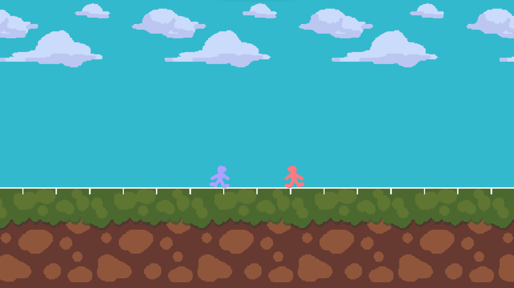
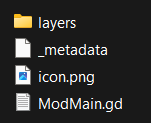
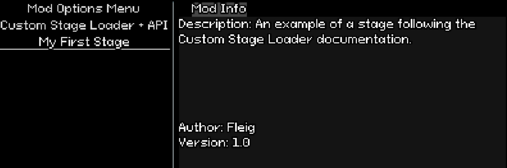

# Getting Started

Although it may look intimidating, making stages using the Custom Stage Loader is not too challenging.
This page will give you the rundown on how to make *your* first stage and package it for everyone else to use.

[](./notice.md ':include')

## Preparing Your ModMain.gd

In order to build and load a stage using the Custom Stage Loader, you'll need a base template, which we've provided below.
This block of code below contains everything you'll need to have in your `ModMain.gd` file *before* you start building your stage.

```gdscript
extends Node

# Loads the CustomStageBuilder class, for use in metadata building
onready var CustomStageBuilder = load("res://custom_stage_loader/CustomStageBuilder.gd");

var Builder;
var Loader;

func _ready():
	# We call the build_stage() function after the game's process queue clears up
	# This is to ensure no errors occur.
	call_deferred("build_stage");

# Here is where the stage building takes place.
func build_stage():
	Builder = CustomStageBuilder.new(); # For building the stage metadata
	Loader = get_tree().get_root().get_node("CSL"); # For loading the stage itself
```
 
## Stage Building

Now, we'll begin building your stage! Make sure you're working inside of Godot, since we'll be needing some SpriteFrames instances.

In this example, we'll be adding a scrolling ground layer and parallax sky layer. 
To start, we'll have to make a `StageBackground` using our stage builder. To do so, simply move on down to your `build_stage()` function.
We'll be adding a call to the builder's `make_background()` function. See [CustomStageBuilder](API/CSL/CustomStageBuilder.md?id=make_background)

```gdscript
# ...

# Here is where the stage building takes place.
func build_stage():
	Builder = CustomStageBuilder.new() # For building the stage metadata
	Loader = get_tree().get_root().get_node("CSL"); # For loading the stage itself

	Builder.data.stage_name = "My First Stage"; # Setting the name of the stage

	Builder.make_background("GroundBackground", {"layer": 1}); # Creating a background to hold our layers setting it's index to 1, so it renders on front.
```

?>`StageBackground`s, when noted from the `CustomStageBuilder` class, are typically only built to hold `StageLayer` instances.
This doesn't mean that you can't add other types of objects using the builder's `add_asset()` function. See [UNFINISHED]()

To make a scrolling ground, we first need to create a `StageLayer`.
For this we can use `make_layer()`, passing the name parameter and calling `get_material_id()` so we can determine the parent `StageBackground` of this layer,
in our case, this will be `GroundBackground`

```gdscript
	# ...

	Builder.make_background("GroundBackground", {"layer": 1}); # Creating a background to hold the ground layer, setting its index to "1"
	
	Builder.make_layer("GroundLayer", Builder.get_material_id("GroundBackground")); # Creating the ground layer, making it a child of GroundBackground
```

?>`StageLayer`s can also have one more additional parameter `data`, in which we can modify the behaviors of the Layer,
such as its position, scale, motion_mirroring, etc. See [UNFINISHED]()

For adding the visual part of our scrolling ground, or in other words, the `StageElement`, we will need to create a new `SpriteFrames` resource.
Name it as you wish, but for convenience's sake, we'll name ours the same as the sprite.

>

We can now double click the `ground.tres` resource to edit it, here we can add several sprites to the `frames` of this resource, but in our case,
we just need to add one.

>

With this setup, we can now go back to the code and use the `make_element()` function to add our ground,
calling the `get_material_id()` function to determine `GroundLayer` as the parent.
In our case, we will also use an additional parameter called `data`, to pick our `SpriteFrames` resource, to set it's position
and to make the ground scroll forever.

```gdscript
	# ...

	# Ground
	Builder.make_layer("GroundLayer", Builder.get_material_id("GroundBackground")); # Creating the ground layer, making it a child of MainBackground

	Builder.make_element("Ground", Builder.get_material_id("GroundLayer"), { # Creating the ground element and changing it's data 
		"frames": "res://MyFirstStage/layers/ground.tres",
		"position": Vector2(0, 75),
		"h_tile": true
	});
```

?> Alternatively, you can manually create your SpriteFrames using code. See [*Creating sprite frames in code*](#frames)

If you did everything right, this should be the result so far:

>

To make a parallax sky, we can create a new `StageLayer` that will be a child of `SkyBackground`.
We can first create a blue background, using the `StageElement`'s `h_tile` and `v_tile` variables to make a seamless blue sky.

```gdscript
	# ...

	Builder.make_background("SkyBackground", {"layer": 0});

	# Sky
	Builder.make_layer("SkyLayer", Builder.get_material_id("SkyBackground")); # Creating the sky layer, making it a child of SkyBackground

	Builder.make_element("Sky", Builder.get_material_id("SkyLayer"), { # Creating the sky element and changing it's data 
		"frames": "res://MyFirstStage/layers/sky.tres",
		"h_tile": true,
		"v_tile": true,
	});
```

To give depth perception, we can now add some clouds and change their `StageLayer` data to modify the `motion_scale` values, creating a parallax effect.
In my case, i added several sprites to my `SpriteFrames` resource of the clouds, so i will also enable animation on the `StageElement`.

```gdscript
	# ...

	# Clouds
	Builder.make_layer("CloudsLayer", Builder.get_material_id("SkyBackground"), {# Creating the clouds layer, making it a child of MainBackground
		"motion_scale": Vector2(0.8, 0.8),
	});

	Builder.make_element("Clouds", Builder.get_material_id("CloudsLayer"), { # Creating the cloud element and changing it's data 
		"active": true,
		"frames": "res://MyFirstStage/layers/clouds.tres",
		"position": Vector2(0, -150),
		"h_tile": true,
	});
```

Lastly, all we have to do now is add our stage using the `Loader` from before:

```gdscript
	# ...
	
	Loader.add_stage(Builder.data);
```

After all that, we have completed our stage!

>

## Exporting the Stage

For exporting, create a folder where you `ModMain.gd` and your assets will sit, in our case, it is named `MyFirstStage`. Create a new file called `_metadata`, it must be a file without a extension.

>

`_metadata` should be formatted as a .json, the keys are as follows:

```json
{
	"name": "myFirstStage",
	"friendly_name": "My First Stage",
	"description": "Adds a stage made following the Custom Stage Loader documentation.",
	"author": "Fleig",
	"version": "1.0",
	"link": "",
	"id": "",
	"requires": ["customStageLoader"],
	"overwrites": false,
	"client_side": true,
	"priority": 1
}
```

You can now zip the folder and place it in the `mods` folder for testing. If everything went well, the stage should appear on the `Mod List`.

>

Feel free to download this example stage yourself and try it out! The download link is <a href="https://hazelpy.github.io/Custom-Stage-Loader-Documentation/files/MyFirstStage.zip">here</a>.

?>Feel free to explore the rest of the documentation and see what results you can come up with! <br>
Come and share how your first stage turned out in our [Discord server](https://discord.gg/keTcqpUQVG).

----

### Creating sprite frames within code :id=frames

Using the following code, we can create and utilize sprite frames within code. This is for if you don't want to open Godot Engine while implementing your stage.

```gdscript
	# ...

	var ground_frames = SpriteFrames.new(); # Instantiate new SpriteFrames object
	ground_frames.add_animation("Default"); # Ensure that the default animation exists
	ground_frames.add_frame("Default", load("res://path/to/image.png")); # Add a frame to the default animation
	
	# We can substitute the path to the SpriteFrames asset, replacing it with our fresh reference instead.
	Builder.make_element("Ground", Builder.get_material_id("GroundLayer"), {
		"frames": ground_frames,
		"position": Vector2(0, 75),
		"h_tile": true
	});
```